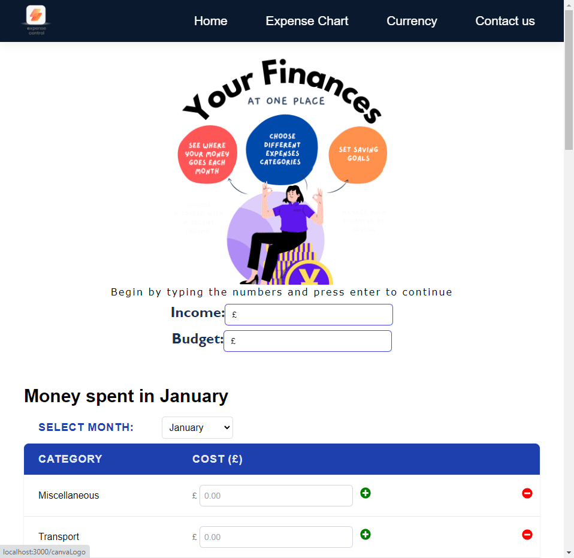

# Expense Control

## User story:
As a user, I want an app to display my income and expenses in different categories: Miscellaneous, Transport, Groceries, Eating out, Shopping, Housing, Utility bills, Broadband and Entertainment. I also want to be able to add new categories, modify my income and budget and see my remaining for each month.

## Description:
Expense control makes your finances easier to manage: with a user friendly design, you can fill in the existing expenses categories, add new ones or delete those that you no longer need. Also, you can see the percentage of spending displayed in a graph. You can also see in what percentile is your income, and compare different exchange rates to save your remaining of the month for your next holiday or to send money to someone abroad.

## Instructions:
1. Type your income and hit enter
2. Repeat step 1 with the 'Budget' category
3. Add your expenses by slecting the number on the dropdown menu and click the '+' button
4. If you want to delete a category, click on the 'X' next to the '+'
5. If you wish to add new categories, scroll down to the 'Add category' section and type the category name and amount and click 'Add'
6. To use the Exchange rate tool, select the amount and the currency type and see the amount reflected.

## Technologies used:
1. React
2. Tailwind (CSS)
3. CanvaPro
4. Chart.js
5. FortAwesome Icons
6. Exchange Icons
7. Exchange Rate API: https://exchangeratesapi.io/
8. Whimsical (Wireframimng)
9. Netlify 

## Presentation link:
https://docs.google.com/presentation/d/1yl1tWCMvxdy6g1ba3PkoSBLXBbXINv4NDgr6g3QxUfI/edit#slide=id.g29f43f0a72_0_0

## Resources:
1. YouTube

## Acknowledgments 

<<<<<<< HEAD
Thank you for all the TAs for all the support provided
=======
Thank you for all the TAs for all the support provided
>>>>>>> main
